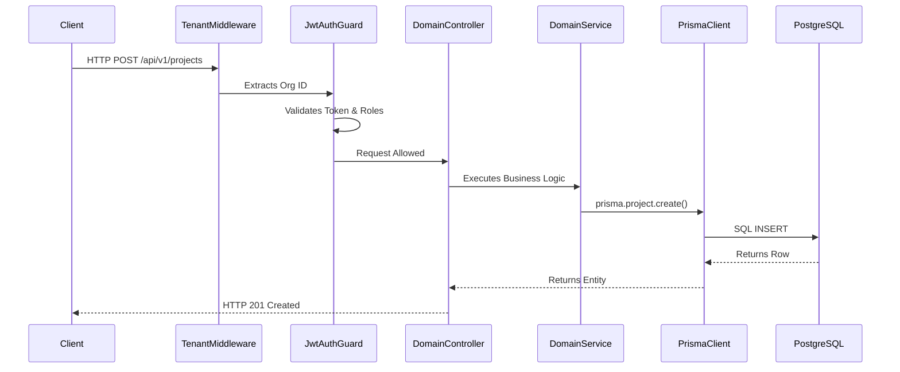

# Developer 2 (Platform Engineer) - Detailed Work Report

## 1. Executive Summary & Role Definition
Developer 2 is responsible for the foundational API architecture, database connection management, security, and global configuration. This role ensures that when other developers write business logic, they do so on a highly stable, typed, and secure platform.

## 2. Deep Dive: What Has Been Implemented

### 2.1 Backend API Core (`apps/backend-api`)
- **Framework Initialization:** Bootstrapped the NestJS application (`main.ts`, `app.module.ts`).
- **Global Configuration:** Configured the application to run on port `3001` with a global route prefix of `api/v1` to support future API versioning.
- **Module Registration:** Set up the root `AppModule` to dynamically import domain-specific modules (Projects, Tasks, WhatsApp, Notifications) cleanly.

### 2.2 Database Layer (`packages/database`)
- **Prisma Integration:** Initialized Prisma ORM. Created the core `schema.prisma` file which serves as the single source of truth for the PostgreSQL database schema.
- **Client Instantiation:** Exported the generated Prisma client. Resolved a critical architectural issue by implementing named exports (`import { prisma } from '@useaxiom/database'`) ensuring that both the `backend-api` and `background-workers` can connect to the database without module resolution errors.
- **NestJS Service Integration:** Built the `PrismaService` inside `apps/backend-api` to manage connection lifecycles (connecting on module init, disconnecting on teardown).

### 2.3 Shared Configuration & Types (`packages/config`, `packages/types`)
- **Type Definitions:** Created `packages/types/src/index.ts` to hold globally shared TypeScript interfaces (e.g., `IProjectCreateDto`). This allows the frontend and backend to share exact data structures without code duplication.
- **Linting & Formatting:** Unified the ESLint and Prettier configurations in `packages/config` so that all `apps` and `packages` adhere to the exact same strict coding standards.

### 2.4 Multi-Tenancy & Security Prep
- **Tenant Middleware:** Defined the structure for `TenantMiddleware`. This middleware intercepts incoming requests, extracts the `x-organization-id` (or JWT payload), and ensures subsequent logic is scoped to the correct tenant.
- **Auth Guards:** Implemented `JwtAuthGuard`, `RolesGuard`, and the `@CurrentUser()` decorator to strictly control access to API endpoints based on user roles (`ADMIN`, `MANAGER`).

## 3. Architectural Decisions & Rationale (The "Why")

### Why NestJS for the Backend?
NestJS forces a highly opinionated, Angular-like structure (Modules, Controllers, Services). In a team environment, this prevents developers from creating disorganized, ad-hoc file structures. Its built-in Dependency Injection container is critical for managing database connections and third-party services.

### Why Prisma ORM?
Prisma provides end-to-end type safety. When a database column changes, TypeScript immediately throws compile-time errors anywhere in the backend (or frontend, via shared types) that references the old column. This drastically reduces runtime errors.

## 4. Exhaustive Tech Stack
- **Framework:** NestJS (`@nestjs/core`, `@nestjs/common`)
- **Database ORM:** Prisma (`prisma`, `@prisma/client`)
- **Database Engine:** PostgreSQL (running via Docker)
- **Typing:** TypeScript
- **Security:** Passport/JWT (scaffolded)

## 5. System Architecture & Flow

## 6. Detailed Step-by-Step Code Flow (Database Initialization)
1. **App Startup:** NestJS boots up via `main.ts`.
2. **Module Init:** The `AppModule` initializes the `PrismaModule`.
3. **OnModuleInit Triggered:** The `PrismaService` (which extends `PrismaClient`) triggers its `onModuleInit()` lifecycle hook.
4. **Connection Pool:** `this.$connect()` is called, establishing a connection pool to the PostgreSQL database defined in the `.env` file.
5. **Ready:** The backend is now ready to securely process incoming requests with isolated database transactions.

## 7. Current State & Immediate Next Steps
The backend foundation is rock solid. Next steps for Dev 2 involve finalizing the JWT authentication issuance logic and working with Dev 5 to ensure database migrations (`prisma migrate dev`) are successfully deployed.
