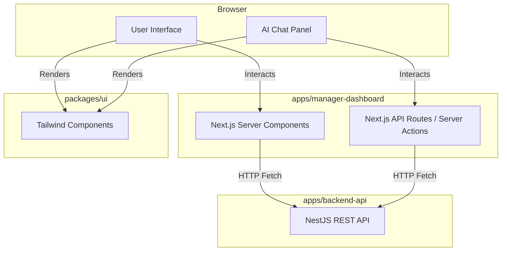

# Developer 3 (Frontend Lead) - Detailed Work Report

## 1. Executive Summary & Role Definition
Developer 3 is responsible for the user-facing web application: the Manager Dashboard. This role ensures that project managers have a lightning-fast, intuitive, and aesthetically premium interface to define projects and interact with the AI orchestration engine.

## 2. Deep Dive: What Has Been Implemented

### 2.1 Next.js Application Scaffolding (`apps/manager-dashboard`)
- **Framework Setup:** Initialized the application using the Next.js App Router paradigm (`app/` directory).
- **Routing Structure:** Scaffolded the core page hierarchy: `/` (Home), `/projects` (Project List), `/projects/[id]` (Project Detail & AI Chat).
- **Build Integration:** Hooked the Next.js build process into the Turborepo pipeline, ensuring it compiles concurrently with the backend API.

### 2.2 Shared UI Component Library (`packages/ui`)
- **Library Initialization:** Created a distinct package specifically for React components.
- **Component Exports:** Set up the `package.json` to correctly export components so the `manager-dashboard` can import them cleanly (e.g., `import { Button } from '@useaxiom/ui'`).
- **TailwindCSS Integration:** Configured TailwindCSS across both the `ui` package and the `manager-dashboard` app. Configured the `tailwind.config.js` to scan both directories for utility classes, ensuring styles are correctly purged and bundled.

### 2.3 Strict Separation of Concerns Enforcement
- Adhered to the `AGENTS.md` rule: *"Frontend apps must never query the database directly."*
- Ensured all data fetching relies on HTTP calls to the `backend-api` rather than server-side Prisma calls within Next.js Server Components.

## 3. Architectural Decisions & Rationale (The "Why")

### Why Next.js App Router?
The App Router allows for a hybrid rendering approach. Server Components can fetch data securely and render HTML on the server (improving SEO and load times), while Client Components (marked with `"use client"`) can handle complex interactive states like the AI Chat Panel.

### Why a separate `packages/ui` library?
If the business decides to launch a separate application in the future (e.g., an Employee Portal or an Admin Control Panel), they can instantly reuse the exact same Buttons, Tables, and Modals without duplicating CSS or React code. It guarantees brand consistency.

## 4. Exhaustive Tech Stack
- **Framework:** Next.js (App Router)
- **UI Library:** React (v18+)
- **Styling:** TailwindCSS (Utility-first CSS)
- **Language:** TypeScript
- **Data Fetching Prep:** Native `fetch` / SWR (planned)

## 5. System Architecture & Flow

## 6. Detailed Step-by-Step Code Flow (Component Rendering)
1. **User Request:** Manager navigates to `/projects`.
2. **Server Execution:** The Next.js `page.tsx` Server Component executes. It performs an HTTP GET request to `http://localhost:3001/api/v1/projects`.
3. **Type Hydration:** The JSON response is typed using `ProjectDto` imported from `@useaxiom/types`.
4. **Component Injection:** The data is passed as props to a `<ProjectList />` component imported from `@useaxiom/ui`.
5. **Browser Paint:** The fully rendered HTML, styled with Tailwind utility classes, is shipped to the browser for near-instant rendering.

## 7. Current State & Immediate Next Steps
The frontend scaffolding is complete and integrated with the build system. The immediate next step is to replace placeholder UI with premium, dynamic Tailwind designs, and to implement the actual Axios/Fetch calls mapping to Dev 5's newly created endpoints.
