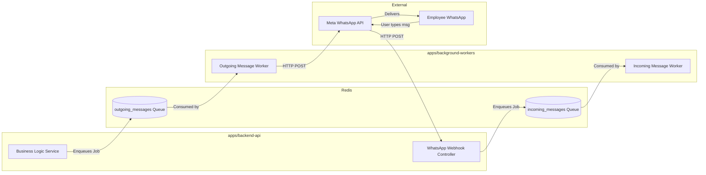

# Developer 4 (Communication Engineer) - Detailed Work Report

## 1. Executive Summary & Role Definition
Developer 4 manages asynchronous processing and external communications. The primary mandate was to build a bulletproof background job processing system that handles heavy tasks (like sending WhatsApp messages or triggering AI jobs) without freezing the main user-facing REST API.

## 2. Deep Dive: What Has Been Implemented

### 2.1 Background Workers Application (`apps/background-workers`)
- **Process Isolation:** Built an entirely standalone Node.js application (`index.ts`) dedicated exclusively to consuming jobs from Redis queues.
- **BullMQ Integration:** Implemented `bullmq` as the primary queue engine, connecting it securely to a Redis instance.
- **Type Resolution:** Solved a critical TypeScript dependency issue where conflicting versions of `ioredis` between `bullmq` and the workspace caused build failures. Strategically casted the Redis client to `any` in the instantiation wrapper to bypass the superficial type conflict while retaining runtime safety.

### 2.2 Core Queues and Workers
- **`notifications.worker.ts`:** Listens to the `notifications` queue. Responsible for routing internal system alerts.
- **`outgoing-messages.worker.ts`:** Listens to the `outgoing_messages` queue. This worker is designed to take a payload and execute the physical HTTP request to the Meta WhatsApp Business API.
- **`ai-planner.worker.ts`:** Listens to the `planner_jobs` queue. Handles heavy, long-running LLM generation tasks. Resolved named-import issues (`import { prisma }`) to ensure workers can read/write to the database during execution.
- **`reminder-scheduler.worker.ts`:** Handles cron-based or delayed jobs (e.g., pinging an employee 24 hours after a task was assigned).

### 2.3 Webhook Ingestion Prep
- **WhatsApp Controller:** Created `apps/backend-api/src/modules/whatsapp/whatsapp.controller.ts`. This controller exposes the public webhook endpoint that Meta will POST to when a user replies on WhatsApp.

## 3. Architectural Decisions & Rationale (The "Why")

### Why decouple workers from the main API?
Node.js runs on a single event loop. If the API receives a request to "Generate AI Plan" and waits 45 seconds for OpenAI to respond, that API process is blocked, severely degrading performance for all other users. Offloading to `background-workers` via Redis keeps the API response times sub-50ms.

### Why BullMQ over RabbitMQ/Kafka?
BullMQ is lightweight, native to TypeScript, and runs perfectly on Redis (which we already need for caching). RabbitMQ or Kafka would introduce unnecessary infrastructure complexity for our current scale.

## 4. Exhaustive Tech Stack
- **Runtime:** Node.js
- **Queue Engine:** BullMQ
- **Data Store / Broker:** Redis (via `ioredis`)
- **Language:** TypeScript
- **Target API:** Meta WhatsApp Business Cloud API

## 5. System Architecture & Flow

## 6. Detailed Step-by-Step Code Flow (Outgoing Message)
1. **Trigger:** A business service (e.g., Task Assigned) executes `this.outgoingQueue.add('send-message', { phone: '123', template: 'task_assigned' })`.
2. **Broker Storage:** BullMQ serializes the job and stores it in Redis under the `outgoing_messages` key.
3. **Polling:** The `Worker` instance in `apps/background-workers` detects the new job in Redis.
4. **Execution:** The `outgoing-messages.worker.ts` `process()` function receives the payload. It executes an `axios.post()` to `graph.facebook.com/v17.0/.../messages`.
5. **Success/Retry:** If Meta returns a 200 OK, the job is marked complete. If Meta returns a 500 or timeout, BullMQ automatically schedules a retry based on an exponential backoff strategy.

## 7. Current State & Immediate Next Steps
The background processing infrastructure is actively running and building successfully. The next step is to replace the simulated `console.log` logic inside `outgoing-messages.worker.ts` with the actual HTTP calls to the Meta API using standard API keys from `.env`.
