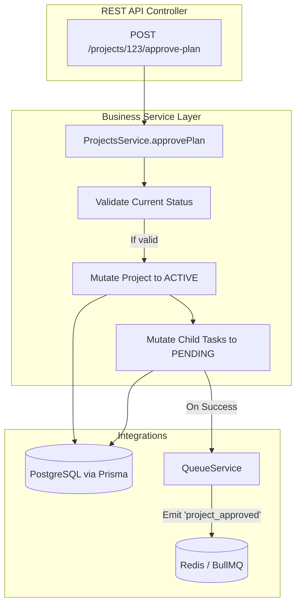

# Developer 5 (Core Business Logic) - Detailed Work Report

## 1. Executive Summary & Role Definition
Developer 5 is responsible for translating the physical requirements of "Project Management" into strict, typed software architectures. This role involves defining the database schemas for Projects, Tasks, and Milestones, and creating the API capabilities that mutate their states.

## 2. Deep Dive: What Has Been Implemented

### 2.1 Technical Debt Eradication & Module Consolidation
- **Notification Unification:** Identified duplicated and conflicting `notifications` modules within the `apps/backend-api/src`. Successfully merged them into a single, cohesive `notifications` module.
- **Module Registration:** Cleaned up `app.module.ts` to ensure all domains (Projects, Tasks, Notifications, Queue, WhatsApp) are imported via a standardized pattern.

### 2.2 Core Business Modules (`apps/backend-api/src`)
- **Projects Module (`projects/`)**: Scaffolded the `projects.controller.ts` and `projects.service.ts`.
- **Tasks Module (`tasks/`)**: Prepared the scaffolding for granular task management.
- **Milestones Module (`milestones/`)**: Prepared the logic for grouping tasks.

### 2.3 Capability-Based API Design
- **Action-Oriented Routes:** Instead of implementing a basic `PUT /projects/{id}` to update a project, designed explicit action routes:
  - `POST /projects/{id}/approve-plan`
  - `POST /projects/{id}/generate-plan`
- **Controller Logic:** Implemented the `@CurrentUser()` decorator to automatically extract the active user's Organization ID, passing it down to the services to ensure strict multi-tenant data isolation.

## 3. Architectural Decisions & Rationale (The "Why")

### Why Capability-Based APIs over CRUD?
CRUD (Create, Read, Update, Delete) is fine for simple data entry. However, approving a project plan is a complex business action. It requires changing a status to `ACTIVE`, emitting events to a background queue to notify employees, and locking certain fields from further edits. By exposing a specific `/approve-plan` endpoint, the intent is perfectly clear, and the side effects are safely encapsulated within the service layer.

### Why consolidate modules early?
When multiple developers work in parallel, duplication naturally occurs (e.g., two people creating a webhook handler). Halting feature work to consolidate these modules ensures the team doesn't build complex logic on top of a fractured foundation.

## 4. Exhaustive Tech Stack
- **Framework:** NestJS
- **Database Client:** Prisma Client (`@prisma/client`)
- **Validation:** `class-validator`, `class-transformer` (for DTO validation)
- **Language:** TypeScript

## 5. System Architecture & Flow

## 6. Detailed Step-by-Step Code Flow (Approving a Plan)
1. **Request:** Client calls `POST /api/v1/projects/xyz/approve-plan`.
2. **Auth Verification:** NestJS `JwtAuthGuard` ensures the user is an `ADMIN` or `MANAGER`.
3. **Controller Execution:** `projects.controller.ts` extracts the `user.organizationId` and calls `projectsService.approvePlan(orgId, projectId)`.
4. **Validation:** The service queries Prisma: `prisma.project.findFirst({ where: { id: projectId, organizationId: orgId } })`. If not found or already active, throws a `NotFoundException` or `BadRequestException`.
5. **Database Transaction:** The service updates the project status to `ACTIVE` and simultaneously updates all associated tasks from `PROPOSED` to `PENDING`.
6. **Event Emission:** The service injects the `NotificationsService` (or `QueueService`) and emits a job: `"Notify all assignees that their tasks are now pending"`.
7. **Response:** Returns `200 OK` to the frontend.

## 7. Current State & Immediate Next Steps
The modules are consolidated and the capability endpoints are defined. The immediate next step is to finalize the Prisma Schema in `packages/database/prisma/schema.prisma` to include exact field requirements (e.g., defining Enums for `ProjectStatus: DRAFT | PROPOSED | ACTIVE | COMPLETED`) and mapping the database relations.
